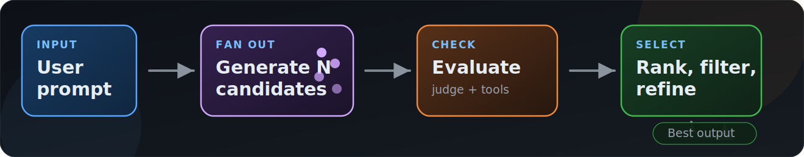

<!-- _class: lead -->
<!-- _paginate: false -->

<div class="kicker">Session 2</div>

# How Your AI Product Team Works

## Systematising Context Management

**Friday, 1st May 2026**

---
<!-- _class: agenda -->

# Today's Agenda


1. **Recap** how agents work, then what orchestration changes
2. **Systematising** agents to build an AI team
3. **The building blocks** state, replay, memory, routing, sandboxing, interoperability
4. **Difficult decisions** latency, cost, reliability, safety, human gates
5. **Measurement & Operability** evals, observability, anti-patterns, design rules

---

<!-- _class: lead -->
<!-- _paginate: false -->

<h2 style="font-size: 1.2em; font-weight: 400; line-height: 1.6; color: var(--text-primary);">
An <abbr title="Large Language Model">LLM</abbr> is a <strong style="color: var(--accent-blue);">next-token prediction engine</strong>
operating over a <strong style="color: var(--accent-blue);">context window</strong>.
</h2>

<h2 style="font-size: 1.2em; font-weight: 400; line-height: 1.6; color: var(--text-primary); margin-top: 0.8em;">
An <strong style="color: var(--accent-orange);">orchestrator</strong> decides which context windows exist, what goes into them, and when their outputs are ready.
</h2>

---

# Cracking the Cryptic

<div style="display: flex; justify-content: center;">

| They say | They mean |
|----------|-----------|
| **Agent** | LLM + tools in a loop |
| **Context engineering** | Choosing what the model can see |
| **Orchestrator** | Systems for getting agents to work together |
| **Memory** | Knowledge persisted outside the context window |
| **Autonomous** | Taking action without human approval |
| **Evaluation** | Proving the "thing" works and is better than alternatives |
| **Safe output** | Tightly controlled tool calls |

</div>

---

# Recap: Next-Token Prediction


An LLM is a **next-token prediction engine** operating over a context window.

```text
Input:  "The cat sat on the"
  → P(mat)=0.23, P(floor)=0.18 ...
  → sample → "mat"
```

- The model sees tokens, not words.
- Tools, files, messages, and examples only matter once represented in context.
- Temperature changes sampling behaviour.

<div class="tiny">
Full slides: https://github.com/crmitchelmore/how-llms-work-presentation
</div>

---

# The Context Window


The context window is the model's working memory for this run.

<table style="font-size: 0.66em; line-height: 1.14;">
<tbody>
<tr><td><strong>The Model</strong></td><td>world knowledge, intelligence </td></tr>
<tr><td><strong>Always there</strong></td><td>provider prompt, system prompt, tool definitions</td></tr>
<tr><td><strong>User supplied</strong></td><td>messages, files, images, instructions, <code>AGENTS.md</code></td></tr>
<tr><td><strong>Retrieved</strong></td><td>RAG snippets, search results, previous notes, docs</td></tr>
<tr><td><strong>Observed</strong></td><td>tool output, test results, logs, diffs</td></tr>
</tbody>
</table>

<div class="small">
More context is not always better. Context quality is a massive differentiator on performance.
</div>

---

<!-- _class: loop-hero -->


# The Agent Loop

An agent is an LLM that runs tools in a loop to achieve a goal.

<div class="loop loop-wide">
<div class="node"><strong>Think</strong><span class="small">choose next step</span></div>
<div class="arrow">&rarr;</div>
<div class="node"><strong>Act</strong><span class="small">call a tool</span></div>
<div class="arrow">&rarr;</div>
<div class="node"><strong>Observe</strong><span class="small">read output</span></div>
</div>

Each loop adds more context. Good agents need ways to manage it:

- compaction and summaries
- writing to "memory" e.g. a .md file
- sub-agents for bounded, separate work (the beginnings of orchestration)

---

# Orchestration Recap: Agent, Orchestrator, Context


An **agent** is an LLM in a tool loop.  
An **orchestrator** is a loop around agents.

<div class="small">
Context is <i><b>still</b></i> everything. We just have more windows now.
</div>

---

<!-- _class: evolution-bg smallish -->


<div class="evolution-overlay">

# Natural Evolution

We are motivated to automate. Earlier workflows kept the coordination in our head:

<div class="ev-questions">

- Which tab had the answer?
- Which agent had the context?
- Which output was safe to trust?
- Which change is ready to merge?

</div>

```text
outcome ≈ model × harness × orchestration
```
<div class="small" style="margin-top:0.4em;">Better models help. Better harnesses and orchestration <span class="highlight">compound</span> the gains.</div>

1. **Context ceiling** — one window gets distracted, stale, or full. AKA Context Rot.
2. **Throughput ceiling** — work can be split, checked, merged faster than one agent in sequence.
3. **Model selection** — different models, different profiles. Make routing automatic.

</div>

---

# The Ladder


Breaks down progression in to manageable steps.

It is fine wherever you are on the ladder!

Treat the levels as a curriculum, not a scoreboard.

<div class="small" style="font-size: 0.55em; line-height: 1.2;">
Learn the mechanics, then add autonomy when you are comfortable to reduce cognitive load.
</div>

---

<!-- _class: hero-bg -->


<div class="hero-card">

# You Can't Outsource Understanding

No one can tell you how to work. Now, more than ever, you need to <span class="highlight">understand how tools and systems work</span> so you can <span class="good">spot issues intuitively</span> and make good decisions — because <span class="bad">the impact is multiples higher</span>.

</div>

---

<!-- _class: analogy-bg -->


<div class="analogy-overlay">

# From Pushing the Car to Taxiing the Plane

<div class="split">
<div class="card car">

<div class="label">Pushing the Car (L1-2)</div>

Approving every action is **safe, but slow**. You check everything. The system goes nowhere without you.

</div>
<div class="card plane">

<div class="label">Taxiing the Plane (L3-7)</div>

Letting an agent run is different. You're still on the ground but moving **fast** and getting ready for takeoff.

</div>
</div>

<div class="footer-banner">

<p class="caption">The risk is not that the plane doesn't work. The risk is pointing it confidently at the wrong destination.</p>

<p class="tag">You have a powerful tool that gets you places quickly — you still need to know where you want to go.</p>

</div>

</div>

---

<!-- _class: tight -->

# More Tokens = Better?

Strong AI systems don’t produce one answer — they **generate candidates, evaluate them, and return the best**.



More tokens help only when diversity and evaluation quality increase. Otherwise you just pay more for the same output.

<div class="grid two" style="gap: 0.85em; margin-top: 0.35em;">
<div class="card blue" style="padding: 0.45em 0.65em;">
<div class="stat" style="font-size: 1.75em;">90.2%</div>
<div class="stat-label" style="font-size: 0.55em;">improvement over single-agent Claude Opus 4 on Anthropic's internal breadth-first research eval.</div>
</div>

<div class="card orange" style="padding: 0.45em 0.65em;">
<div class="stat" style="font-size: 1.75em; color: var(--accent-orange);">15x</div>
<div class="stat-label" style="font-size: 0.55em;">more tokens than ordinary chat in Anthropic's production research system.</div>
</div>
</div>

<div class="tiny" style="margin-top: 0.3em;">Source: Anthropic, "How we built our multi-agent research system" (2025).</div>


---

<!-- _class: part2-hero -->


# 2: Systematising

<p class="manifesto">
Orchestration is <strong>context engineering</strong> at system level.
</p>

<div class="grid two part2-cards">
<div class="card orange">

### Agent
Manages **one** context window.

</div>
<div class="card blue">

### Orchestrator
Manages **many** context windows.

</div>
</div>

<blockquote class="attrib">
"Context engineering: the delicate art and science of filling the context window with just the right information for the next step."
<cite>— Andrej Karpathy, June 2025</cite>
</blockquote>

---

# Review Workflow

Create a new agent session to check the work and even the same model will find improvements.

<div class="grid two">
<div class="card blue">

### Why does it work?

- fresh context, fewer inherited assumptions
- attention on review
- focused on evidence: diff, tests, brief

</div>
<div class="card orange">

### How to run it? (/review)

Give the reviewer:
- original requirement
- changed files / PR diff
- verification output
- known risks and non-goals

</div>
</div>

---


# Orchestration SDLC

- **Planner / router**: generates work, dependencies, assignment.
- **Workers**: specific context, scoped tools and instructions.
- **Verifier**: runs checks, reviews outputs, scores confidence.
- **Integration gate**: merges, deploys, posts, writes.
- **Human gate**: work out where you need this but (for now) always approves irreversible, ambiguous, high-risk actions.
- **Trace**: persists state, decisions, costs, artefacts.

<div class="small" style="margin-top: 0.6em;">Not everything needs to be AI!</div>

---

<!-- _class: parallel watermark -->


<div class="kicker">Where you've seen this before</div>

# Your Team Already Does This

<div class="parallel-card">

PM scopes the ticket. Engineers split the work. PM verifies. The release owner ships. On call engineer checks the metrics.

The orchestration roles aren't new.

</div>

---

# The State of Things


Ensure that the system is aware of relevant state so it can make good decisions. 
Deeply consider how you know what you know and if the agents can get that knowledge too.

| Kind              | What it tracks                                                                        |
| ----------------- | ------------------------------------------------------------------------------------- |
| **Work state**    | files, ticket info, comments, APIs, branches, deployments.                            |
| **Process state** | What the orchestrator believes is scheduled, pending, running, blocked, failed, done. |
| **World state**   | External facts needed for decisions: feature flags, configs, environment, time        |

---

<!-- _class: parallel watermark -->


<div class="kicker">Where you've seen this before</div>

# Your Team Already Tracks State

<div class="parallel-card">

Git Branches. The Jira board. Code-freeze calendar. Deploy markers.

How would a new starter know where to look?

</div>

---
# Memory

Memory is **knowledge persisted outside the context window** plus **retrieval rules**. 

<table style="font-size: 0.58em; line-height: 1.07;">
<thead>
<tr><th>Where</th><th>Examples</th><th>Strength</th><th>Weakness</th></tr>
</thead>
<tbody>
<tr><td><strong>Markdown</strong></td><td><code>AGENTS.md</code>, custom files, ADRs</td><td>Git-backed, reviewable, easy for agents</td><td>Can drift or become unstructured</td></tr>
<tr><td><strong>Summary</strong></td><td>sub-agent returns, compaction, hand-off notes</td><td>Compact, cheap to pass</td><td>Lossy</td></tr>
<tr><td><strong>Structured store</strong></td><td>Beads, SQL/Dolt, checkpoints, vector DBs</td><td>Queryable, resumable</td><td>Schema and sync overhead</td></tr>
<tr><td><strong>System APIs</strong></td><td>Jira, Git History, Sharepoint, Confluent</td><td>Expansive</td><td>Lack of integration, data quality, accurate retrieval is harder</td></tr>
</tbody>
</table>

---

<!-- _class: parallel watermark -->


<div class="kicker">Where you've seen this before</div>

# Your Team Already Remembers

<div class="parallel-card">

Runbooks, ADRs, ticket history, PR history, meeting notes, team conventions.

Think about how to make this tacit knowledge available to the agents.

</div>


---

# Context, Memory, State

<table>
<thead>
<tr><th>Concept</th><th>Truth level</th><th>Lifetime</th><th>Example</th></tr>
</thead>
<tbody>
<tr><td><strong>Context</strong></td><td>transient</td><td>one run</td><td>prompt, tool outputs</td></tr>
<tr><td><strong>Memory</strong></td><td>derived</td><td>multi-run</td><td>summaries, embeddings</td></tr>
<tr><td><strong>State</strong></td><td>authoritative</td><td>system lifetime</td><td>DB, Git, tickets</td></tr>
</tbody>
</table>

> Agents reason over <span class="highlight">memory</span>, but systems act on <span class="good">state</span>.

---

<!-- _class: hero-bg -->


<div class="hero-card">

<div class="kicker">Resume where you left off</div>

# Resilience

If a run <span class="bad">pauses</span>, <span class="bad">crashes</span>, or <span class="warn">waits for approval</span> — <span class="highlight">where do we resume</span> and <span class="good">what is the relevant state?</span>

Reproducibility ≠ determinism (log inputs, seeds, tool versions, environment)
</div>

---

<!-- _class: parallel watermark -->


<div class="kicker">Where you've seen this before</div>

# Your Team Already Hands Off

<div class="parallel-card">

Handover notes say what was done, what failed, and what should happen next — so the next person picks up without repeating the discovery.

</div>

---

# Routing


For one agent: *what tokens go into the window?*
For an orchestrator: *what tokens go into **which** window, when, with which tools, and with what output contract?*

<div class="axis">
<div class="step"><strong>Intent</strong><br/>What is being asked?</div>
<div class="step"><strong>Capability</strong><br/>Who can do it?</div>
<div class="step"><strong>Context</strong><br/>What do they need? What's the scope?</div>
<div class="step"><strong>Authority</strong><br/>Whose identity acts, and what can it touch?</div>
<div class="step"><strong>Escalation</strong><br/>When should the worker stop and ask?</div>
<div class="step"><strong>Verification</strong><br/>Which checks must pass?</div>
<div class="step"><strong>Contract</strong><br/>What must come back?</div>
</div>

---

<!-- _class: parallel watermark -->


<div class="kicker">Where you've seen this before</div>

# Your Team Already Routes Work

<div class="parallel-card">

An EM assigns the bug to the right engineer with the right context, the right authority, and a clear expectation of what comes back.

</div>

---

# How Agents Communicate


- **Direct hand-off** — router assigns task → worker executes → returns structured result
- **Shared artefacts** — files, issues, PRs, comments, logs, test results
- **Messaging & events** — webhooks, workflow runs, queues, event streams

| Interface  | Boundary             | Type                        | **Key Property**          |
| ---------- | -------------------- | --------------------------- | ------------------------- |
| **MCP**    | Agent to tools       | Structured request/response | Deterministic* execution  |
| **A2A**    | Agent to agent       | Multi-turn messaging        | Coordination / delegation |
| **Events** | Workflow to workflow | Asynchronous signals        | Durable, replayable       |

---

<!-- _class: parallel watermark -->


<div class="kicker">Where you've seen this before</div>

# Your Team Already Coordinates

<div class="parallel-card">

Standups, PR comments, tickets, design docs.

Shared artefacts are what's exchanged, not what's thought. 

</div>

---

<!-- _class: divider -->


# **4: Difficult Decisions**

Good judgement is more essential than ever. The only way to make good decisions is to <span class="highlight">increase your understanding</span> of the <span class="highlight-blue">systems you work on</span> and the <span class="highlight-blue">tools you use</span>.

---

# Latency, Cost, Reliability

<table>
<thead>
<tr><th>Design choice</th><th>Latency</th><th>Cost</th><th>Reliability</th></tr>
</thead>
<tbody>
<tr><td><strong>One strong agent</strong></td><td>Predictable</td><td>Lower</td><td>Can get stuck in one path</td></tr>
<tr><td><strong>Parallel workers</strong></td><td>Lower wall-clock if independent</td><td>Higher tokens</td><td>More coverage, more merge risk</td></tr>
<tr><td><strong>Verifier loop</strong></td><td>Slower</td><td>Higher</td><td>Usually better if checks are real</td></tr>
<tr><td><strong>Human gate</strong></td><td>Slower and bursty</td><td>Human attention</td><td>Can still be better in some cases. Direct accountability</td></tr>
<tr><td><strong>Remote runner</strong></td><td>Queue and cold-start cost</td><td>Infra + tokens</td><td>Better isolation and audit</td></tr>
</tbody>
</table>

---

<!-- _class: tight -->

# Verification, Guardrails, Integration

<div class="grid three">
<div class="card blue">

### Verification

Did it solve the problem?

Tests, fresh-session review, evals, replay, comparison, user acceptance. Use deterministic checks first.

</div>
<div class="card orange">

### Guardrails

What is it allowed to do?

Permissions, tool scopes, egress, safe outputs, approvals.

Guardrails reduce risk. Boundaries are easier to verify.

</div>
<div class="card green">

### Integration

When does it become real?

Merge queues, deploy gates, comments, writes, release controls. Escalate when the loop stops converging.

</div>
</div>

<div class="loop">
<div class="node"><strong>Attempt</strong><span class="small">agent proposes change</span></div>
<div class="arrow">&rarr;</div>
<div class="node"><strong>Check</strong><span class="small">test, lint, eval, fresh review</span></div>
<div class="arrow">&rarr;</div>
<div class="node"><strong>Repair or escalate</strong><span class="small">bounded retries</span></div>
</div>

> Verification should come before autonomy. Collapsing all three into "safety" hides the design problem.


---
# The Lethal Trifecta


There are risks when an agent has:

1. <span class="bad">**Access to private data**</span> — everything on the machine
2. <span class="warn">**Exposure to untrusted content**</span> — anything that could get in to context
3. <span class="highlight">**External communication**</span> — any tool or mechanism that outputs to the world

There are mitigations for all three, but the practical solution for orchestration cases is <span class="good">managing external communication</span>.

---
# AI Sandboxes: Containing Blast Radius


- A "safe" space that's ephemeral
- Tighter controls on inputs and outputs
- Apply deterministic checks on tool calls 

<div class="small">
Sandboxing puts your agents in a box but, they still might try to get out. 
</div>

---

# GitHub Agentic Workflows

GitHub is useful here because sandboxing is a core component and well integrated with our tooling.

<table style="font-size: 0.66em; line-height: 1.12;">
<thead>
<tr><th>Layer</th><th>What it does</th></tr>
</thead>
<tbody>
<tr><td><strong>Runtime</strong></td><td>Markdown workflow compiles to <code>.lock.yml</code>; runs on an ephemeral Actions runner with logs and artefacts.</td></tr>
<tr><td><strong>Containment</strong></td><td>Read-only agent job, tool allow-lists, MCP Gateway, AWF / Copilot firewall egress rules.</td></tr>
<tr><td><strong>External writes</strong></td><td><b>Safe Outputs</b>, threat checks, scoped write jobs, human PR gate.</td></tr>
</tbody>
</table>

---

<!-- _class: tight -->

<style scoped>
section .chip { font-size: 0.6em; padding: 0.1em 0.5em; }
section .card h3 { font-size: 0.92em; margin-bottom: 0.35em; }
section .card { padding: 0.55em 0.7em; }
section pre { font-size: 0.5em; margin: 0; padding: 0.6em 0.8em; }
</style>

# Safe Outputs to the Rescue

Safe outputs let gh-aw turn an agent's *intent* into a GitHub action — without giving the agent write credentials. The agent emits a typed request; a separate, tightly scoped step performs it.

<div class="grid three" style="margin-top: 0.4em;">
<div class="card blue">

### Issues & discussions

<span class="chip">create-issue</span>
<span class="chip">update-issue</span>
<span class="chip">close-issue</span>
<span class="chip">add-labels</span>
<span class="chip">remove-labels</span>
<span class="chip">assign-to-user</span>
<span class="chip">create-discussion</span>

</div>
<div class="card orange">

### Pull requests

<span class="chip">create-pull-request</span>
<span class="chip">update-pull-request</span>
<span class="chip">push-to-pr-branch</span>
<span class="chip">add-reviewer</span>
<span class="chip">create-pr-review-comment</span>
<span class="chip">resolve-review-thread</span>

</div>
<div class="card green">

### Comments & escalation

<span class="chip">add-comment</span>
<span class="chip">hide-comment</span>
<span class="chip">assign-to-agent</span>
<span class="chip">link-sub-issue</span>

</div>
</div>

<div class="grid two" style="margin-top: 0.45em; grid-template-columns: 1.15fr 1fr; align-items: center; gap: 1em;">

<pre><code>safe-outputs:
  add-comment: {}
  create-pull-request: { max: 2 }
  add-labels: { allowed: [bug, triage, needs-info] }</code></pre>

<div class="small" style="margin: 0; font-size: 0.55em;">
The frontmatter is the contract. Anything outside it can't happen — no matter what the model decides.
</div>

</div>

---

# Stop That Agent!

Escalation is part of product development. A good system knows when it's necessary to stop and ask for input.

<table>
<thead>
<tr><th>Trigger</th><th>What the system should do</th><th>Why</th></tr>
</thead>
<tbody>
<tr><td>Ambiguous requirement</td><td>Ask or produce options</td><td>Prevents silent policy decisions</td></tr>
<tr><td>Failed verification</td><td>Retry, then escalate</td><td>Prevents infinite loops</td></tr>
<tr><td>Irreversible action</td><td>Require human approval</td><td>Keeps accountability clear</td></tr>
<tr><td>Permission gap</td><td>Stop with exact missing capability</td><td>Avoids unsafe workarounds</td></tr>
<tr><td>Cost or time runaway</td><td>Pause, summarise, ask</td><td>Protects the budget</td></tr>
</tbody>
</table>

<div class="small">
The more the process highlights the gaps, the easier it is to fill them correctly and increase autonomy without losing alignment.
</div>

---

<!-- _class: divider -->


# 5: Measurement & Operability
## If the Work Happens Out of Sight, Make It Observable

---

# Make the Work Visible


Once there are multiple workers it can be hard to know where the solution came from.

<div class="columns" style="gap: 1.2rem;">
<div>

```text
issue triage
├─ planner          1.2k tokens
├─ log researcher   8.4k tokens
├─ implementer     14.1k tokens
├─ fresh reviewer   5.3k tokens
└─ integration gate safe output
```

</div>
<div>

| View | Shows |
|---|---|
| **Trace** | workers, tools, context |
| **Cost** | tokens, loops, retries |
| **Evals** | quality per run |
| **Spans** | model, agent, MCP |

</div>
</div>

**OpenTelemetry has emerging GenAI conventions**. But observability and devX metrics haven't changed!

---

# Things That Go Wrong

It's very easy for these systems to appear highly effective. Check the details early to avoid disappointment!

| Failure shape                  | What happens                                            |
| ------------------------------ | ------------------------------------------------------- |
| **Context / memory poisoning** | Untrusted or bad data changes future behaviour.         |
| **Tool misuse**                | Correct-looking call, wrong authority or target.        |
| **Denial of wallet**           | Loops burn tokens, jobs, or cloud resources.            |
| **Cascading failure**          | One agent's bad output becomes another's trusted input. |
| **Prompt as policy**           | "don’t deploy to prod" (prompt) vs IAM deny (policy)    |
| **Weak sandbox boundary**      | Broad token, open egress, or hidden writes leak risk.   |
| **Bottlenecks**                | The slow point moves to merge, review, or the humans.   |

If it must not happen, enforce it outside the model.

---

<!-- _class: hero-title -->


# The Most Important Question to Answer

---
# Is It Actually Better?

<div class="columns">
<div class="card blue">

### Offline - (Testing feedback)

- fixed task set, golden outputs
- rubric judging (LLM + human)
- replay old failures against new prompts
- compare prompt/tool versions (A/B)
- run N trials to measure variance

</div>
<div class="card orange">

### Online - (Production feedback)

- acceptance rate / rollback rate
- human edit distance
- time to merge / resolution
- escalation reasons and frequency
- cost per useful outcome
- regression rate after prompt changes

</div>
</div>

> Is this workflow better than the alternative?

<div class="tiny">

Non-deterministic does not mean unmeasurable.

</div>

---

# Measure Before You Scale

Before adding users, agents, or autonomy, prove the system works.

<table style="font-size: 0.66em; line-height: 1.12;">
<thead>
<tr><th>Non-negotiable before scaling</th><th>Make it quantitative</th></tr>
</thead>
<tbody>
<tr><td>Task success rate by category</td><td>Run N trials and compare distributions</td></tr>
<tr><td>Human edit distance</td><td>Validate LLM judges against human labels</td></tr>
<tr><td>Cost per useful outcome</td><td>Track trends, not point-in-time accuracy</td></tr>
<tr><td>Escalation rate and reasons</td><td>Measure judge agreement and false positives</td></tr>
<tr><td>Rollback frequency</td><td>Treat prompt changes like code: PR, test, deploy, monitor</td></tr>
</tbody>
</table>

> Verification has to be designed into the workflow.


---
# How to Get Going?

<div class="stack">
<div class="layer"><strong>1. Start with the queue</strong><span>Which repeated workflow is painful, explicit, and checkable?</span></div>
<div class="layer orange"><strong>2. Define the contract</strong><span>What is the brief, output, done state, failure state, and escalation path?</span></div>
<div class="layer purple"><strong>3. Pick the smallest runtime</strong><span>Same chat, sub-agent, worktree, sandbox, remote runner, or workflow engine?</span></div>
<div class="layer green"><strong>4. Add verification before autonomy</strong><span>Checks, evals, reviews, safe outputs, and human gates.</span></div>
<div class="layer red"><strong>5. Instrument from day one</strong><span>Trace decisions, tool calls, costs, retries, acceptance, and rollback.</span></div>
</div>

---

# What It Looks Like

A bug report arrives. Orchestration adds structure around the work.

<div class="axis">
<div class="step"><strong>Triage</strong><br/>Classify, dedupe, find owner, define done.</div>
<div class="step"><strong>Research</strong><br/>Fresh worker reads logs, code, tickets, prior fixes.</div>
<div class="step"><strong>Change</strong><br/>Scoped worker edits in an isolated branch or runner.</div>
<div class="step"><strong>Verify</strong><br/>Tests, fresh-session review, policy checks, replay old failure.</div>
<div class="step"><strong>Integrate</strong><br/>Safe output: PR, comment, deploy request, or human gate.</div>
</div>

Then measure it: time to resolution, rollback rate, edit distance, escalation reason, cost per useful fix.

> Parallel workers help only when the system around them is reliable.

---

# What We Covered

1. **The recap** — models work through context; agents add a tool loop.
2. **The system** — orchestration manages many context windows.
3. **The building blocks** — state, memory, routing, communication, parallelism, sandboxing.
4. **The hard decisions** — autonomy, safety, reliability, escalation, safe outputs.
5. **Measurement** — traces, evals, failure shapes, and proof before scale.

> **Key point:** the goal is not more agents. It is clearer boundaries, measured outcomes, and reliable integration.

---

# Next Time: Show and Tell


Session 3 is where the theory meets practice:

- demos from teams or individuals using orchestration today
- what worked, what failed, what surprised people
- how are you measuring outcomes?
- reusable patterns we should standardise

> Bring a workflow and the numbers behind it.

---

<!-- _class: lead -->
<!-- _paginate: false -->


# Thank You


